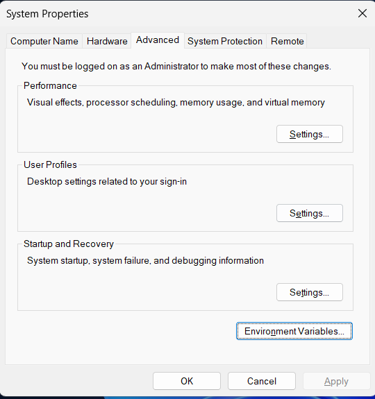
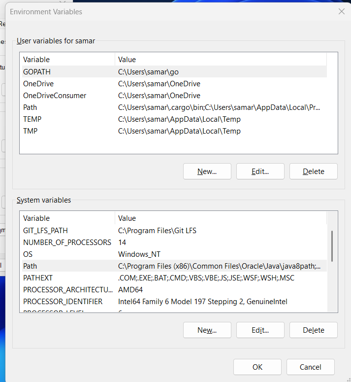
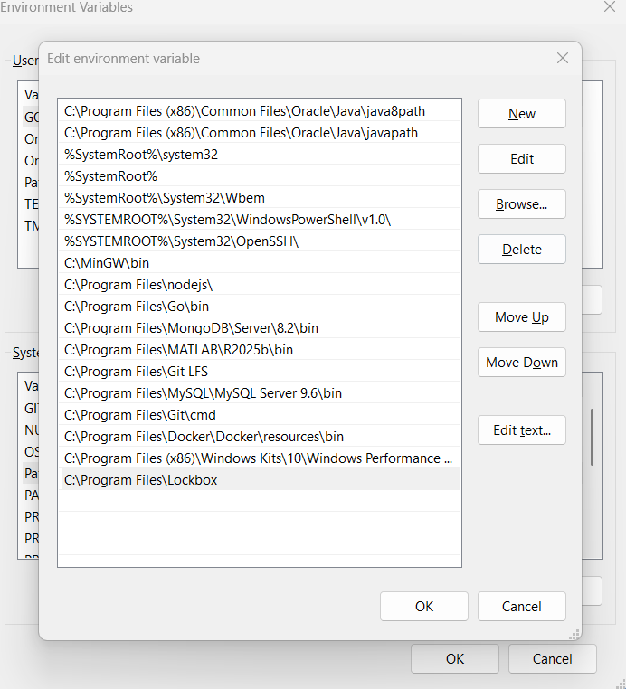

# LockBox (`lb`)

A command-line file and directory encryption tool written in Rust.

Encrypt any file or folder with a password. The output is a `.lb` file that can only be decrypted with the same password.

---


## Installation

### If you don't have Rust:

1. Go to the [Releases](https://github.com/ResiduosCodeur/Lockbox/releases) page and download `lb.exe`
2. Create a folder at `C:\Program Files\Lockbox` and place `lb.exe` inside it
3. Search for **"Edit the system environment variables"** in the Windows search bar
   
4. Click **Environment Variables** → under **System Variables**, click on **Path** → click **Edit**
   
5. Click **New** and paste `C:\Program Files\Lockbox`, then click **OK** on everything
   
6. Open a **new terminal** and run:

```bash
lb --version
```

It should print the installed version of LockBox :)

---

## Usage

Go to the folder in which the file you want to encrypt exists and open a terminal

### Encrypt a file

```bash
lb encrypt myfile.txt
```

You'll be prompted to enter and confirm a password. This produces `secret.txt.lb`.

### Encrypt a directory

```bash
lb encrypt myfolder
```

Recursively packs and encrypts the entire folder into `myfolder.lb`.

### Paths with spaces

Wrap the path in quotes:

```bash
lb encrypt "my secret folder"
lb encrypt "C:\Users\samar\Documents\my file.txt"
```

### Decrypt

```bash
lb decrypt myfile.txt.lb
lb decrypt myfolder.lb
```


Strips the `.lb` extension and restores the original — a file for single files, a folder for directories.

Decrypt to a custom path:

```bash
lb decrypt myfile.txt.lb -o output.txt
lb decrypt myfolder.lb -o restored_folder
```

> **⚠️ Warning:** The .lb format uses AES-256-GCM authenticated encryption. If the encrypted file is modified, corrupted, or tampered with in any way, decryption will permanently fail — there is no recovery mechanism. Renaming the file is safe, but editing its contents will destroy it permanently. Always keep a backup of the original file before encrypting..

### Delete the original after encrypting

Simple delete (fast, OS-level removal):

```bash
lb encrypt myfile.txt --delete-original
```

Secure shred (3-pass overwrite: zeros → ones → random, then delete):

```bash
lb encrypt myfile.txt --shred
```

> **Note:** On SSDs with wear-levelling, overwriting in-place isn't guaranteed to hit
> the same physical sectors. Full disk encryption is the strongest protection for SSDs.

---

## How it works

1. You provide a password
2. A random salt is generated, and your password + salt are fed into **Argon2id** to derive a strong AES-256 key
3. For directories, all files are packed into a single archive blob first
4. The payload is encrypted using **AES-256-GCM**, which also produces an authentication tag
5. Everything needed to decrypt (metadata, salt, nonce, ciphertext + tag) is packed into a `.lb` file

If anyone tampers with the `.lb` file, decryption will fail — the authentication tag catches it.

---

## The `.lb` file format

```
Offset   Size   Field
0        4      Magic bytes: "LBOX"
4        1      Version (currently 2)
5        1      Payload kind: 0 = single file, 1 = directory archive
6        8      Created-at timestamp (Unix seconds, u64 LE)
14       8      Original plaintext size in bytes (u64 LE)
22       1      Original name length (u8, max 255)
23       N      Original name (UTF-8)
23+N     16     Salt (Argon2 input)
39+N     12     Nonce (AES-GCM input)
51+N     M+16   Ciphertext + GCM authentication tag
```

---


### Inspect a `.lb` file without decrypting

```bash
lb info secret.txt.lb
```

Example output:

```
  File        : secret.txt.lb
  LB version  : 1
  Type        : Single file
  Created     : 2024-11-03 14:22:10 UTC
  Origin name : secret.txt
  Plain size  : 12.50 KB (12800 bytes)
  Enc size    : 12.52 KB (12832 bytes)
  Algorithm   : AES-256-GCM + Argon2id
```


---

## Security notes

- **Argon2id** is used for key derivation with 64 MiB memory, 3 iterations, 4 lanes — deliberately slow to resist brute-force attacks
- **AES-256-GCM** provides both encryption and authentication
- The derived key is zeroed from memory immediately after use
- Salt and nonce are randomly generated per encryption — encrypting the same file twice produces different output every time
- Directory archives check for path traversal attacks on unpack (e.g. `../../etc/passwd`)
- `--shred` performs a 3-pass overwrite before deletion (zeros, ones, random)
- If you lose your password, there is no recovery. The encryption is real.

---

## Dependencies

| Crate | Purpose |
|-------|---------|
| `aes-gcm` | AES-256-GCM encryption |
| `argon2` | Password-based key derivation |
| `clap` | CLI argument parsing |
| `indicatif` | Terminal progress bars and spinners |
| `rand` | Cryptographically secure random number generation |
| `rpassword` | Password input without terminal echo |
| `walkdir` | Recursive directory traversal |
| `zeroize` | Securely wipe key from memory after use |
| `anyhow` | Error handling |